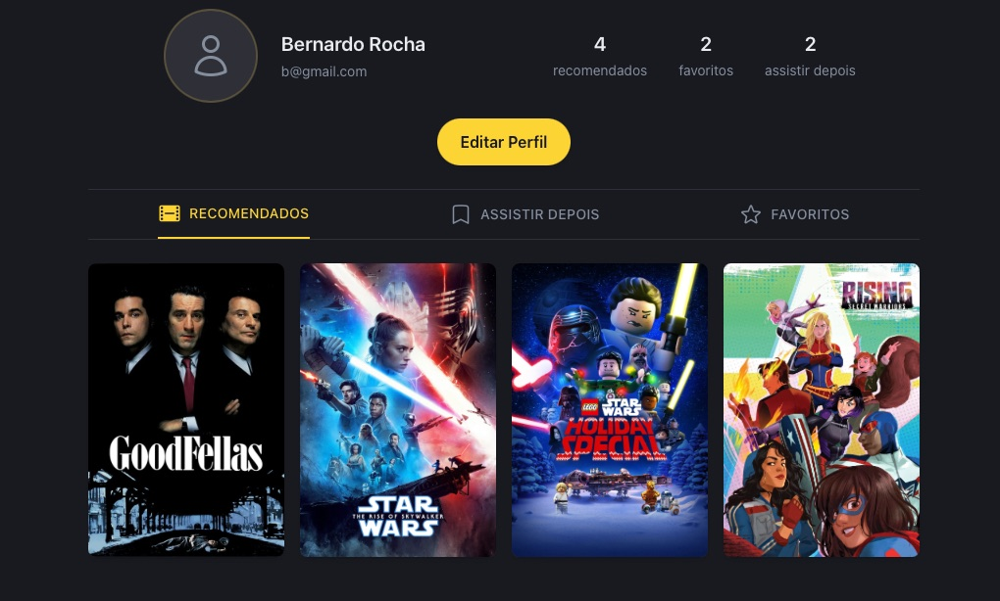
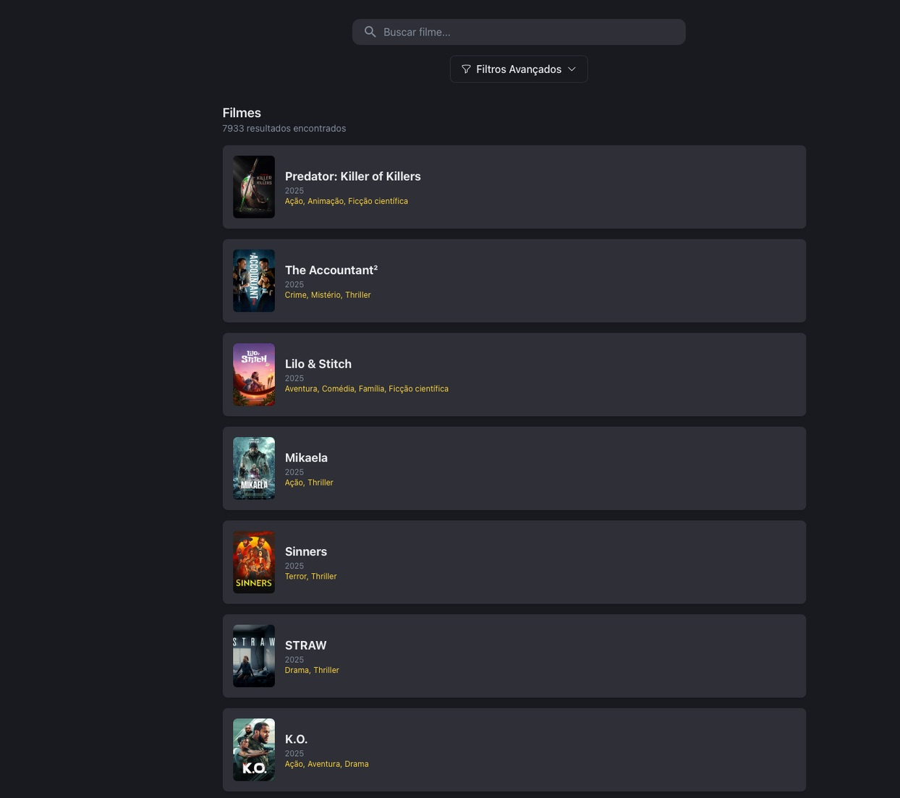
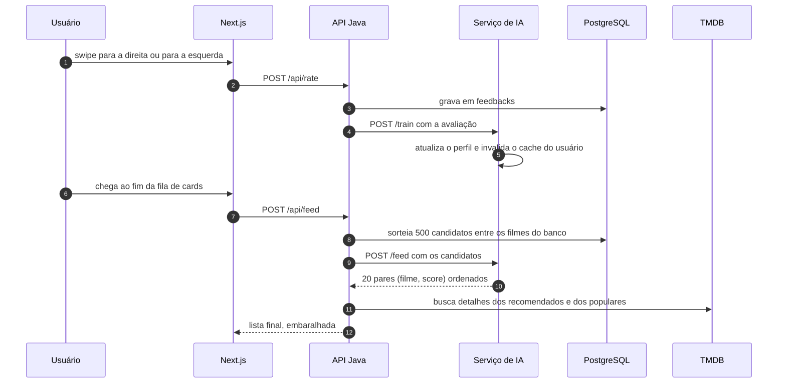
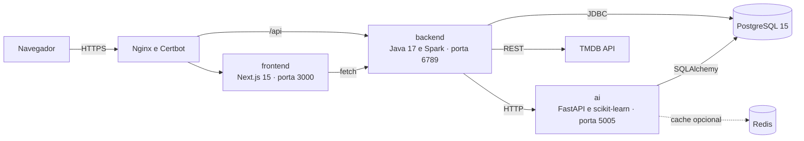
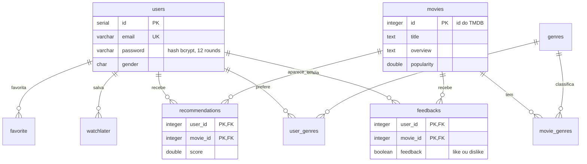

# Flixmate

Recomendador de filmes com feed em formato de swipe. Cada like ou dislike vira treino
incremental de um modelo híbrido que reordena o que aparece em seguida.


Trabalho Interdisciplinar do curso de Ciência da Computação da PUC Minas, escrito entre
fevereiro e junho de 2025. São quatro serviços em containers: uma aplicação Next.js, uma API
em Java, um serviço de recomendação em Python e o PostgreSQL.

> **Status:** o ambiente de produção em `flixmate.com.br` foi desligado depois da entrega.
> O projeto continua reproduzível localmente: veja [Rodando local](#rodando-local).

## Telas

Imagens da entrega, em junho de 2025.

Perfil, com as três listas que o usuário acumula enquanto avalia:



Busca sobre o catálogo importado, com filtro por gênero, intervalo de anos e ordenação:



## Guia de leitura

Se você abriu o repositório para olhar código, estes são os arquivos que valem a visita:

| Arquivo | Linhas | O que tem lá |
| --- | --- | --- |
| [`ai/recommender.py`](ai/recommender.py) | 1070 | o modelo híbrido: TF-IDF, SVD, pesos adaptativos e cache versionado |
| [`backend/src/main/java/app/Application.java`](backend/src/main/java/app/Application.java) | 1502 | as 26 rotas HTTP, o middleware de JWT e a política de CORS |
| [`ai/inference.py`](ai/inference.py) | 499 | a API FastAPI que serve o modelo e dispara retreino em background |
| [`frontend/src/app/page.jsx`](frontend/src/app/page.jsx) | 570 | o feed de swipe e a fila de pré-carregamento dos cards |
| [`database/scripts/init.sql`](database/scripts/init.sql) | 116 | o schema: 9 tabelas, chaves compostas e índices |

A divisão de trabalho entre as quatro pessoas está no
[histórico de contribuições](https://github.com/rubensbkl/Flixmate/graphs/contributors).

## Como funciona

O ciclo principal é o mesmo em toda sessão: o usuário avalia, o modelo aprende, o próximo
feed muda.



## Arquitetura



O backend não fala scikit-learn e o serviço de IA não fala JWT. A fronteira entre os dois é
um contrato HTTP de três rotas (`/train`, `/recommend`, `/feed`), o que permite treinar,
reiniciar ou trocar o modelo sem tocar na API. As justificativas de cada escolha estão em
[`docs/ARCHITECTURE.md`](docs/ARCHITECTURE.md).

## O modelo de recomendação

**Conteúdo.** Gênero, os primeiros 200 caracteres da sinopse e o idioma original de cada
filme viram um texto único, vetorizado com TF-IDF (500 features, unigramas, remoção de
stopwords em inglês). O score de um candidato é a média do cosseno entre ele e os filmes que
o usuário curtiu, mais um bônus de 0.3 por gênero que o usuário declarou no cadastro.

**Colaborativo.** As avaliações formam uma matriz esparsa usuário por filme (`csr_matrix`)
reduzida com `TruncatedSVD`. O score sai do produto entre os fatores latentes do usuário e os
do item.

**Combinação adaptativa.** O peso entre os dois depende de quanto o sistema já sabe sobre a
pessoa, que é a forma de lidar com o cold start:

| Interações do usuário | Peso do conteúdo | Peso do colaborativo |
| --- | --- | --- |
| menos de 5 | 0.8 | 0.2 |
| 5 ou mais | 0.4 | 0.6 |

**Cache.** A recomendação final é guardada por 10 minutos sob uma chave derivada do md5 da
lista de candidatos, e o modelo colaborativo por 1 hora. Toda chave carrega a versão do
modelo, então um retreino invalida o conjunto inteiro com um incremento. O Redis é opcional:
se a conexão falhar na subida, o serviço registra o aviso e segue sem cache.

**Origem dos dados.** O catálogo vem do TMDB e as avaliações iniciais do MovieLens, ligadas
pelo `tmdbId` do `links.csv`. Os scripts de `ai/` e `database/scripts/` fazem o caminho de
preparação: filtro de qualidade e idioma, corte dos ratings para os filmes que existem no
banco, importação e treino inicial.

## Modelo de dados



Os ids de `movies` e `genres` são os mesmos do TMDB, o que evita uma tabela de correspondência
e mantém as chamadas à API externa diretas.

## Stack

| Camada | Tecnologia | Nota |
| --- | --- | --- |
| Frontend | Next.js 15 (App Router), React 18, Tailwind, MUI | swipe com `react-tinder-card`, animações com Framer Motion |
| Backend | Java 17, Spark Java 2.9, Gson, JDBC | JWT HMAC256 (`java-jwt`), senha com bcrypt (`jbcrypt`) |
| IA | Python 3.11, FastAPI, scikit-learn, pandas, SQLAlchemy | modelo persistido em pickle, retreino em background |
| Dados | PostgreSQL 15, Redis (opcional) | schema em `database/scripts/init.sql` |
| Infra | Docker Compose, Nginx, Certbot, GitHub Actions | deploy por SSH a cada push na `main` |

## Rodando local

Pré-requisitos: Docker, Docker Compose e uma chave da
[API do TMDB](https://developer.themoviedb.org/docs).

```bash
git clone https://github.com/rubensbkl/Flixmate.git
cd Flixmate
cp .env.example .env    # preencha TMDB_API_KEY e JWT_SECRET
docker compose -f docker-compose.dev.yml up --build
```

- Frontend: <http://localhost:3000>
- API: <http://localhost:6789>
- Serviço de IA: <http://localhost:5005/docs> (Swagger gerado pelo FastAPI)

O `init.sql` sobe as tabelas e os 19 gêneros do TMDB. O catálogo de filmes não vem no
repositório: para popular o banco, veja [`docs/DATASET.md`](docs/DATASET.md).

Para produção há o `docker-compose.yml`, que sobe a mesma pilha com Nginx e Certbot na
frente. Ele precisa de um domínio apontado para a máquina e do `NEXT_PUBLIC_API_URL` com a URL
pública, porque esse valor é embutido no bundle durante o build.

## API

26 rotas sob `/api`, todas em JSON. Autenticação com JWT no header `Authorization: Bearer`,
exigida em tudo menos `/api/login`, `/api/register`, `/api/verify` e `/api/ping`. A referência
completa está em [`docs/API.md`](docs/API.md).

| Grupo | Rotas |
| --- | --- |
| Sessão | `POST /api/login`, `POST /api/register`, `GET /api/verify` |
| Feed e avaliação | `POST /api/feed`, `POST /api/rate`, `GET /api/rate/:movieId`, `DELETE /api/rate/:movieId` |
| Recomendações | `GET /api/recommendations/:userId`, `GET /api/recommendation`, `POST /api/recommendation/delete` |
| Perfil | `GET /api/profile/:userId`, `POST /api/profile/update`, listas de favoritos e watchlist |
| Busca | `GET /api/movies/search`, `GET /api/profiles/search` |

## Limitações conhecidas

O projeto foi entregue com dívidas que a gente conhece e prefere deixar escritas:

- `Application.java` concentra as 26 rotas em um arquivo só. A separação em controllers estava
  no plano e não entrou.
- Não há teste automatizado no backend Java. O serviço de IA tem `ai/test_train.py`.
- Cada DAO abre a própria conexão com `DriverManager`, sem pool.
- `UserDAO.getAll` e `GenreDAO.getAll` usam `Statement` em vez de `PreparedStatement`. As duas
  queries não recebem parâmetro, então não há injeção possível, mas o padrão devia ser um só.
- O feed sorteia 500 candidatos a cada chamada e não guarda o que já foi mostrado, então um
  filme pode reaparecer entre páginas.
- O retreino do modelo colaborativo é síncrono dentro do serviço de IA: com base grande, a
  primeira recomendação depois de um retreino demora.

## Equipe

Trabalho Interdisciplinar, Ciência da Computação, PUC Minas, 2025.

- [Bernardo Vieira Rocha](https://github.com/bernardovieirarocha)
- [Carlos Eduardo de Melo Sabino](https://github.com/cadumeloo)
- [Felipe Costa Unsonst](https://github.com/felipeunsonst)
- [Rubens Dias Bicalho](https://github.com/rubensbkl)

Professores responsáveis: Walisson Ferreira de Carvalho e Wladmir Cardoso Brandão.
