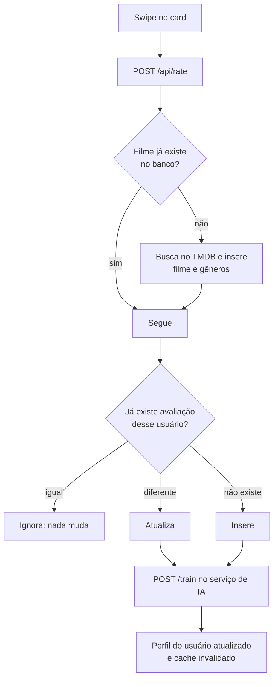
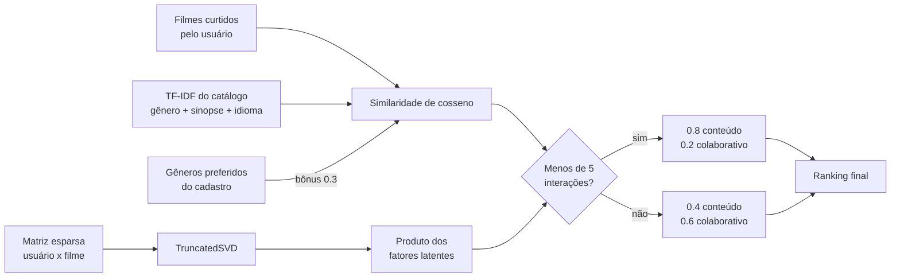

# Arquitetura

Este documento explica por que o Flixmate está dividido do jeito que está, o que passa entre
cada parte e onde ficaram as dívidas.

## Visão geral

Quatro serviços, cada um em um container:

| Serviço | Stack | Porta | Responsabilidade |
| --- | --- | --- | --- |
| `frontend` | Next.js 15, React 18, Tailwind | 3000 | interface, feed de swipe, sessão no cliente |
| `backend` | Java 17, Spark Java | 6789 | regra de negócio, autenticação, acesso ao banco, TMDB |
| `ai` | Python 3.11, FastAPI, scikit-learn | 5005 | treino e inferência do modelo de recomendação |
| `postgres` | PostgreSQL 15 | 5432 | usuários, filmes, avaliações, recomendações |

Em produção o Nginx termina o TLS e roteia: `/` vai para o Next.js e `/api/` vai para o
backend. O serviço de IA e o Postgres não são expostos para fora da rede do Compose.

## Decisões e trade-offs

**Spark Java em vez de Spring Boot.** A ementa da disciplina pedia Java, e o grupo já
conhecia Spark do semestre anterior. O ganho foi subir a API sem configuração e enxergar
todas as rotas em um lugar; o custo aparece em `Application.java`, que cresceu para 1502
linhas porque não existe a camada de controller que o Spring daria de graça. Com o volume de
rotas que o projeto acabou tendo, Spring Boot teria sido a escolha certa.

**Serviço de IA separado, e não uma biblioteca Java.** O modelo é scikit-learn, e não existia
equivalente maduro no ecossistema Java para o que o grupo queria fazer. Manter o modelo atrás
de um contrato HTTP de três rotas deixou o treino e a inferência independentes do ciclo de
vida da API: dá para reiniciar, retreinar ou trocar o modelo sem derrubar o backend. O preço
é uma chamada de rede a mais no caminho do feed.

**Ids do TMDB como chave primária.** `movies.id` e `genres.id` são os ids do próprio TMDB. Isso
elimina a tabela de correspondência e deixa qualquer resposta do banco pronta para virar
chamada à API externa. Em troca, o catálogo local fica preso à numeração de um terceiro.

**Redis opcional.** O cache acelera a recomendação, mas o serviço sobe sem ele: a falha na
conexão é capturada na importação e todo `get` passa a devolver o valor padrão. Isso mantém o
`docker compose up` de desenvolvimento leve, com um serviço a menos para subir.

**Avaliação booleana.** O feedback é `true` ou `false`, não uma nota de 1 a 5. Combina com a
interface de swipe e simplifica a matriz do modelo colaborativo, ao custo de perder
intensidade de preferência.

## O caminho de uma avaliação

A resposta diz qual das três coisas aconteceu (`CREATE`, `UPDATE` ou `IGNORED`), e o treino
só dispara nas duas primeiras. Para apagar uma avaliação existe `DELETE /api/rate/:movieId`.

O ponto importante do desenho é que a escrita no Postgres e o aviso ao serviço de IA são
independentes: se o serviço de IA estiver fora do ar, a avaliação continua registrada e o
modelo se recupera no próximo retreino cheio, que lê tudo do banco.

## O caminho do feed

1. O frontend pede uma página do feed.
2. O backend lê todos os ids de filmes, embaralha e corta em 500 candidatos.
3. O serviço de IA pontua os 500 e devolve os 20 melhores.
4. O backend busca no TMDB os detalhes desses 20 e mistura com os populares da página pedida.
5. A lista final volta embaralhada, para que o feed não seja uma fila óbvia de score
   decrescente.

O passo 2 é o ponto fraco conhecido: o sorteio é sem memória, então filmes podem repetir entre
páginas. A correção seria excluir do sorteio o que já está em `feedbacks` e paginar por um
cursor estável em vez de por número de página.

## Contrato entre backend e serviço de IA

| Rota | Entrada | Saída |
| --- | --- | --- |
| `POST /train` | `{"ratings": [{"user", "movie", "rating"}]}` | confirmação e versão do cache |
| `POST /recommend` | `{"user", "candidate_ids", "top_n"}` | melhor filme e score |
| `POST /feed` | `{"user", "top_n", "candidate_ids"}` | lista de pares (filme, score) |
| `GET /health` | | estado do modelo, do Redis e do último treino |
| `POST /admin/reload_model` | | recarrega o modelo do disco |

O serviço publica o Swagger em `/docs` quando está no ar.

## Modelo de recomendação

O híbrido tem duas metades e um peso que muda com o histórico.

O modelo colaborativo só entra quando existe base suficiente: sem ratings, `TruncatedSVD` não
é treinado e o score colaborativo fica em zero, o que faz o híbrido virar puramente conteúdo.
É o comportamento desejado para um banco recém importado.

### Cache

Todas as chaves do Redis carregam a versão do modelo (`...:v{n}`). Um retreino incrementa essa
versão, o que invalida o conjunto inteiro sem precisar varrer chave por chave. TTLs: 10
minutos para a recomendação final, 1 hora para os fatores do modelo colaborativo.

## Segurança

- Senha com bcrypt, 12 rounds (`util/PasswordUtil.java`).
- JWT assinado com HMAC256 e validado em um `before("/api/*")`, que injeta `userId` e
  `userEmail` na requisição. As rotas públicas são `login`, `register`, `verify` e `ping`.
- CORS por lista de origens permitidas, com o header refletido só quando a origem confere.
- Consultas parametrizadas com `PreparedStatement`, com as duas exceções listadas no README.

## Dívidas conhecidas

As dívidas estão listadas no [README](../README.md#limitações-conhecidas). As três que mais
pesariam em uma continuação: separar `Application.java` em controllers, colocar um pool de
conexões no lugar do `DriverManager` por DAO, e dar memória ao sorteio de candidatos do feed.
